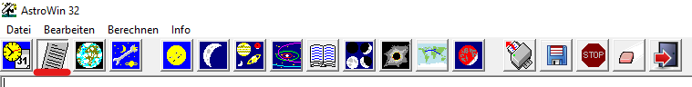
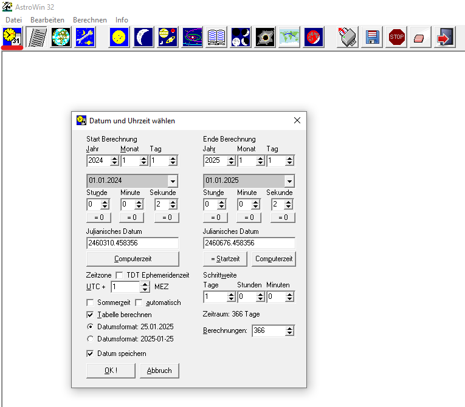
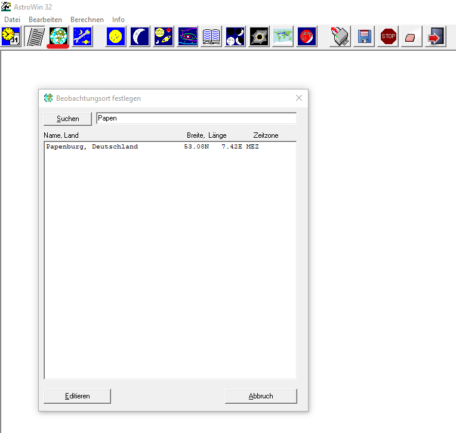
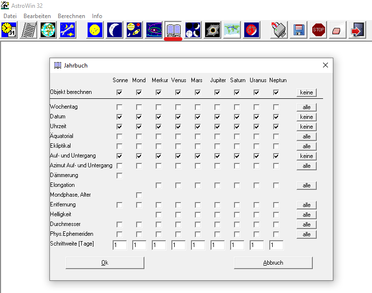
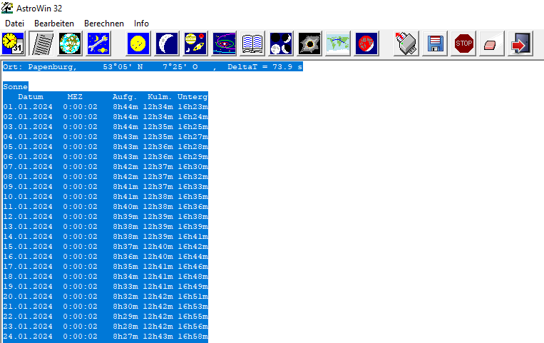
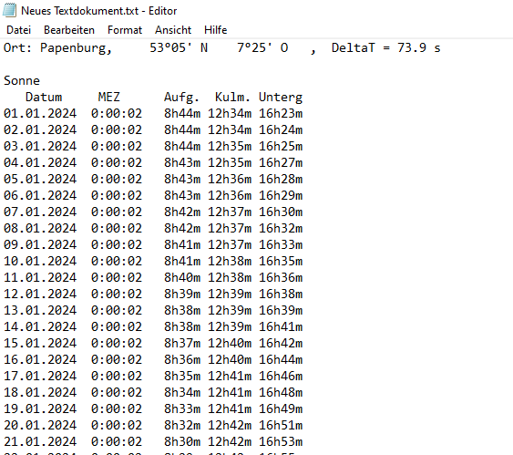
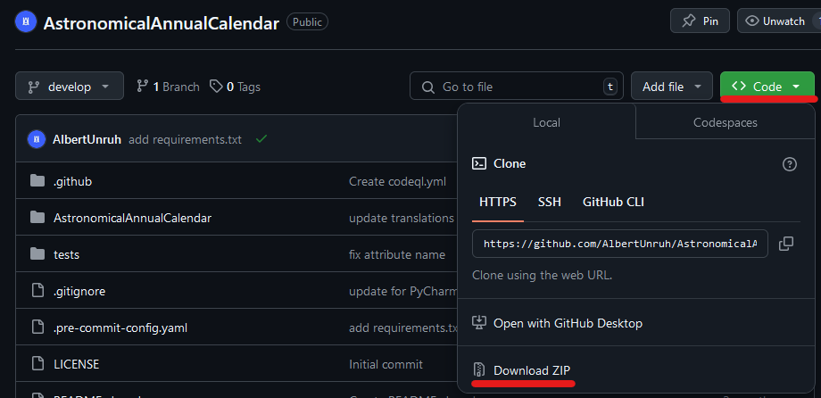
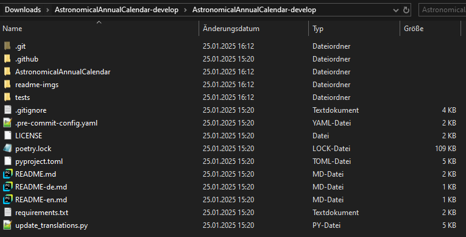
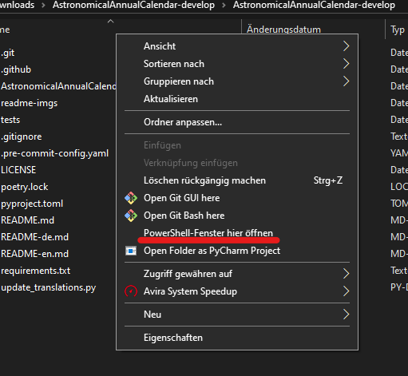

# Astronomische Jahreskalender

Dieses Projekt entstand als kleine Programmieridee, nachdem ich bei uns auf der Sternwarte einen [per Hand erstellten Kalender][AJK] ([Archiv][]) gesehen habe.
Die händische Erstellung ist zeitaufwändig und ungenau, da der Einfachheit halber Mittelwerte genommen werden.

[AJK]: https://sternwarte-papenburg.de/jahreskalender/download/ajk_2024.pdf
[Archiv]: https://web.archive.org/web/20240531110805/https://sternwarte-papenburg.de/jahreskalender/download/ajk_2024.pdf

### Aber wie nutze ich nun dieses Projekt?

Das Projekt ist als Kommandozeilen-Tool entwickelt worden. Das heißt, dass es keine visuelle Oberfläche gibt.

Folgendes muss auf dem System verfügbar sein:
- Python 3.12+ ([download][Python])
- AstroWin32 *von Dr. Wolfgang Strickling* ([download][AstroWin])

[Python]: https://www.python.org/downloads/
[AstroWin]: https://www.strickling.net/software.htm

Wenn nun alle Programme vorhanden sind, müssen Daten beschafft werden. Dafür wird AstroWin32 verwendet.

#### Schritt für Schritt: AstroWin32

1. Listenberechnung aktivieren  
   *Knopf muss "gedrückt" aussehen*
   
2. Datum und Uhrzeit auswählen  
   Beispiel für das Jahr 2024:
   
3. Beobachtungsort festlegen  
   Beispiel für Papenburg:
   
4. "Jahrbuchmodus" auswählen  
   *Hier die minimale Auswahl an Häkchen, die benötigt werden. Es ist möglich alles auszuwählen, die Daten werden nur nicht verwertet.*
   
5. Anschließend auf "Ok" drücken und warten, bis kein neuer Text mehr erscheint
6. In Textfeld klicken und ``strg + A`` (der Text sollte blau werden) und ``strg + C`` drücken
   
7. Im Explorer ein neues Textdokument erstellen und öffnen.
8. In Textfeld klicken und ``strg + V`` (der eben kopierte Text sollte erscheinen) und ``strg + S`` drücken
   
9. Die Datei ist gespeichert und kann geschlossen werden. **Der Pfad wird im Verlauf aber noch wichtig!**

#### Schritt für Schritt: AstronomicalAnnualCalendar

1. Projekt von [GitHub][] herunterladen und ZIP entpacken
   
2. Im Explorer in entpackten Ordner navigieren  
   *So in etwa sollte es aussehen*
   
3. ``shift + Rechtsklick`` drücken und "PowerShell-Fenster hier öffnen" anklicken
   
4. In die nun geöffnete Befehlszeile je nach präferenz den gewünschten Befehl zum Installieren der Abhängigkeiten eingeben und ausführen:
   - ``pip install -r requirements.txt``
   - ``poetry install``
     - Poetry Version < 2.0.0: ``poetry shell`` einmalig ausführen
     - Poetry Version ≥ 2.0.0: ``poetry run`` vor jedes ``python ...`` setzen
5. Eine Übersicht aller Befehle sollte mit dem Befehl ``python -m AstronomicalAnnualCalendar`` einsehbar sein
6. Der grundlegende Befehl zum Generieren sieht wie folgt aus: ``python -m AstronomicalAnnualCalendar -l de generate -s Textdatei -d AJK.pdf``
   - ``-l de`` setzt die Sprache auf Deutsch
   - ``Textdatei`` muss durch den Pfad von der vorhin erstellten Textdatei ersetzt werden
   - ``-d AJK.pdf`` speichert das Ergebnis unter "AJK.pdf"
7. Glückwunsch! Der astronomische Jahreskalender wurde generiert!  
   *Für mehr Details zum Befehl, kann ``python -m AstronomicalAnnualCalendar generate --help`` ausgeführt werden*

[GitHub]: https://github.com/AlbertUnruh/AstronomicalAnnualCalendar

### Irgendwelche Fragen?
Erstelle bitte ein [Issue][], ich werde schnellstmöglich assistieren!

[Issue]: https://github.com/AlbertUnruh/AstronomicalAnnualCalendar/issues
